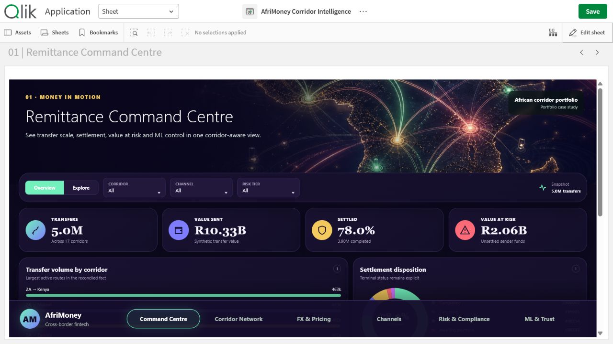

# AfriMoney Corridor Intelligence

An employer-facing Qlik Sense Desktop portfolio app with six complete decision pages, a custom responsive extension and original project-specific artwork.

## Six pages

1. Remittance Command Centre
2. Corridor Network Intelligence
3. FX & Pricing Intelligence
4. Agent & Digital Channel Intelligence
5. Customer Risk & Compliance
6. Snowpark ML & Trust

## Open locally

1. Copy `AfriMoney Corridor Intelligence.qvf` to `Documents/Qlik/Sense/Apps`.
2. Copy `extension/afrimoney-corridor-intelligence` to `Documents/Qlik/Sense/Extensions/afrimoney-corridor-intelligence`.
3. Launch Qlik Sense Desktop and open the app.

The extension is bundled because the report uses a custom full-screen visual system. Data and model caveats are kept visible inside the app.
